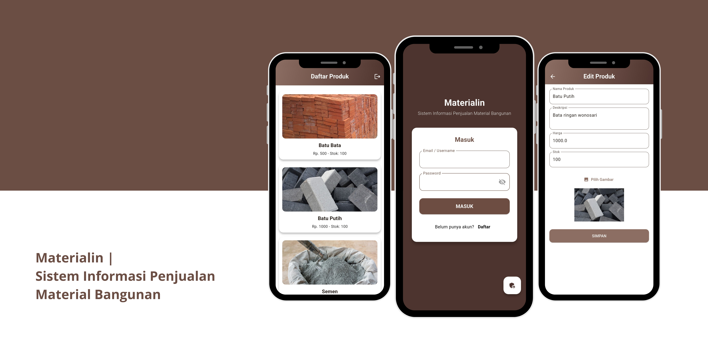

##

### Materialin, Sistem Informasi Penjualan Material Bangunan

## 📙 Description

Materialin is a mobile-based application designed to manage the sales of construction materials effectively. This system provides essential features for both sellers (admin) and buyers (customers) in one integrated platform, supporting product management and shopping convenience anytime, anywhere.

## 📖 Features

Main features in the **Materilin** application:

### 🔐 Authentication

- Admin and customers can log in with registered accounts.
- Customers can **register directly** via the mobile application.

### 🛠️ Product Management (Admin)

- Admin can perform **CRUD (Create, Read, Update, Delete)** on product data, including:
- Product name
- Product description
- Price
- Stock
- Product image
- This feature makes it easier for admins to manage product information in real-time.

### 🛒 Product Catalog (Customers)

- Customers can see the **list of building material products** available.
- Product details are displayed in full, including name, description, price, and stock availability.
- The interface is designed to be easy for customers to search for and view products.
